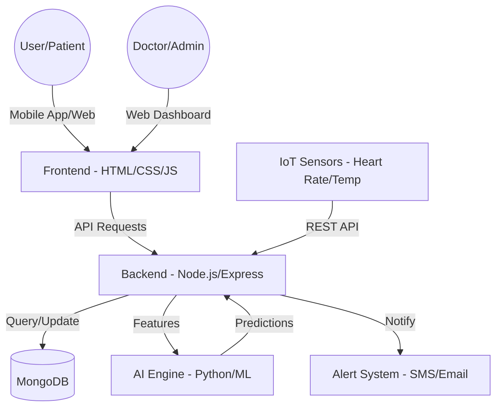
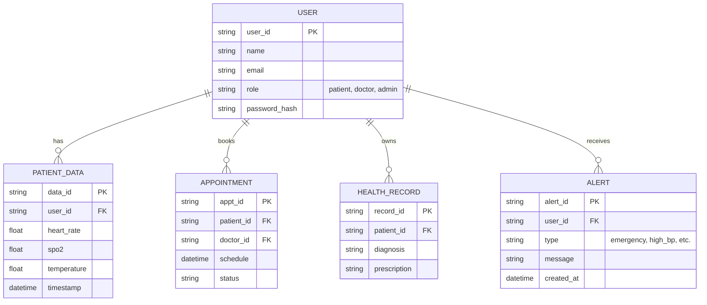

# System Design & Architecture

## 1. System Architecture Diagram (Mermaid)



## 2. Entity Relationship (ER) Diagram



## 3. Database Schema (MongoDB Collections)

### Users Collection
```json
{
  "_id": "ObjectId",
  "name": "Vignesh",
  "email": "vignesh@example.com",
  "password": "hashed_password",
  "role": "admin",
  "profile": {
    "age": 30,
    "gender": "male",
    "location": "Chennai"
  }
}
```

### HealthData Collection
```json
{
  "_id": "ObjectId",
  "patient_id": "ObjectId",
  "vitals": {
    "heart_rate": 72,
    "spo2": 98,
    "temp": 36.6
  },
  "timestamp": "2023-10-27T10:00:00Z"
}
```

### Appointments Collection
```json
{
  "_id": "ObjectId",
  "patient_id": "ObjectId",
  "doctor_id": "ObjectId",
  "date": "2023-10-28T11:00:00Z",
  "status": "confirmed"
}
```
